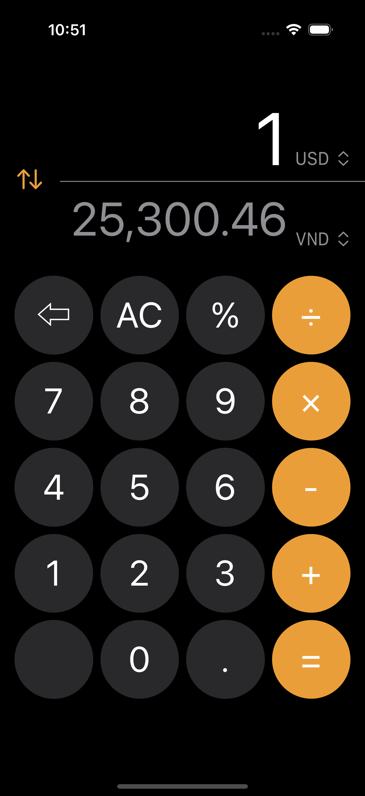
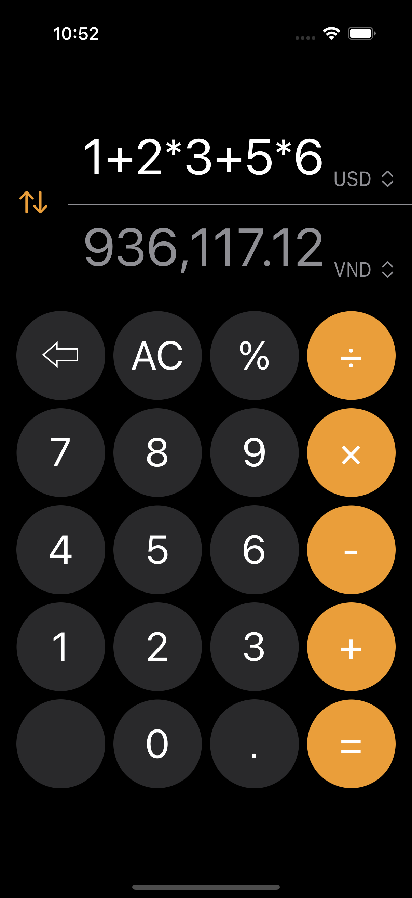
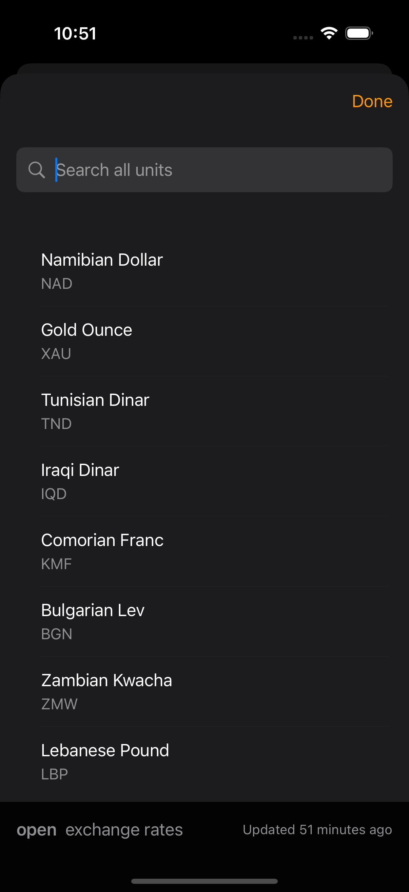

# Project: Currency Converter

## Description:
An currency converter app that mimics the behavior of the built-in iOS calculator app. The app has a simple and intuitive interface. Using api from `open exchange rates` to get the latest exchange rates. The app include a expression evaluator to calculate the result of the expression, help user easily calculate. The app also support offline mode, user can use the app without internet connection. The app using UserDefaults to saved state.


## Key Features:
1. Using the MVVM pattern
1. Includes UI and Unit Tests
1. Support offline mode
1. Expression evaluator
1. Using UserDefaults to saved state and caching
1. Using `open exchange rates` api to get the latest exchange rates
1. Using swift concurrency to handle async task

## Technologies:
1. SwiftUI
1. Swift Concurrency
1. UserDefaults
1. Unit Tests

## Project Structure:
1. **MainApp**: Contains the app configuration and entry point.
1. **Global**: Contains the API config key.
1. **Models**: Contains the data models and services.
1. **Presentation**: Contains the views and view models.
1. **Resources**: Contains the assets and localization files.
1. **Protocols**: Contains the protocols used in the app.
1. **Extensions**: Contains the extensions used in the app.
1. **Services**: Contains the services used in the app.
1. **Utilities**: Contains the utilities used in the app.


## Installation

To run Currency Converter locally, follow these steps:

1. Clone the repository:
```bash
https://github.com/hoangkhoachau/CurrencyConverter.git
```

2. Required
```bash
Xcode 15.0
IOS 18.0
```
3. Configure Open Exchange Rates API:
- Sign up for a free account at Open Exchange Rates and obtain an API key.
- Replace your API Key or Access Token to the Global/API.swift file:
```bash
struct API {
    #warning("Add your API key")
    static let key = "Your_API_Key"
}

```

4. Run the app:
- Connect to your IOS device or Simulator.
- Run in your Xcode.


## Demo
**Demo Video:**
[Currency Converter](https://youtube.com/shorts/HW_HTr-hGEM?feature=share)

**Screenshots:**



